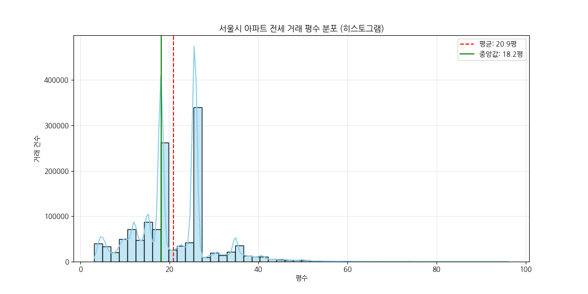
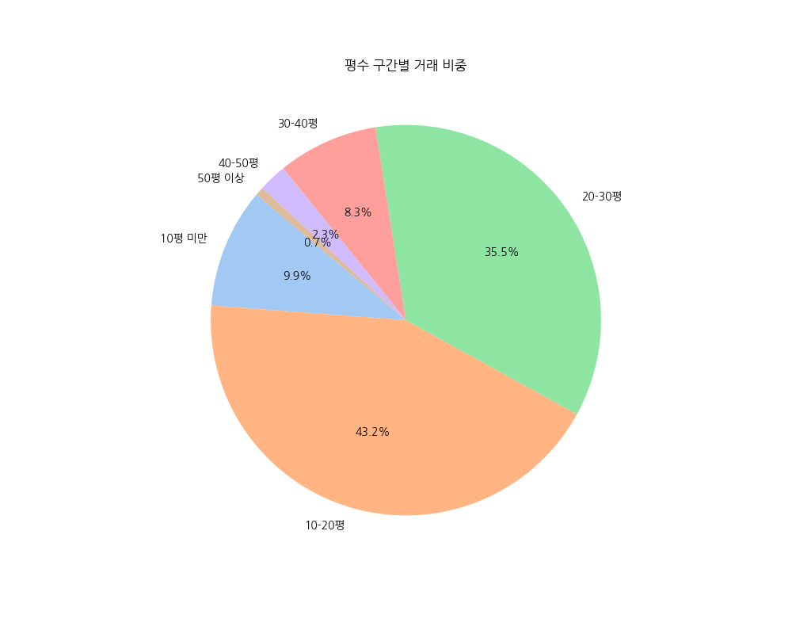
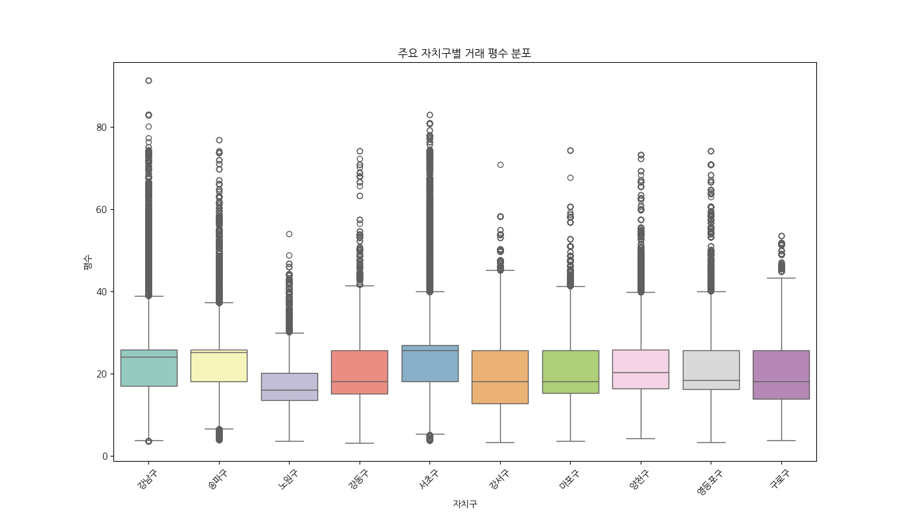

# 서울시 아파트 전세 거래 평수 분포 EDA 보고서

## 1. 데이터 개요
- **분석 대상**: 2021년 ~ 2026년 서울시 아파트 전세 거래 내역
- **총 거래 건수**: 1,287,402건

## 2. 평수 기초 통계량
|      count |    mean |     std |     min |     25% |     50% |     75% |     max |
|-----------:|--------:|--------:|--------:|--------:|--------:|--------:|--------:|
| 1.2874e+06 | 20.9158 | 8.90446 | 3.12773 | 15.1424 | 18.1788 | 25.7333 | 96.1697 |

- **평균 평수**: 20.92평
- **중앙값 (50%)**: 18.18평
- **최대 평수**: 96.17평 (이상치 제외 후)

## 3. 시각화 분석
### 전체 평수 분포 히스토그램

> **해석**: 대부분의 거래가 20~30평 대역에 집중되어 있는 것을 확인할 수 있습니다.

### 평수 구간별 비중

### 주요 자치구별 평수 분포 현황

## 4. 가장 빈번하게 거래되는 전용면적 Top 10
|   전용면적_m2 |   거래건수 |    평수 |
|----------:|-------:|------:|
|     84.98 |  25204 | 25.75 |
|     84.99 |  22809 | 25.75 |
|     84.97 |  20117 | 25.75 |
|     59.99 |  18984 | 18.18 |
|     59.98 |  18870 | 18.18 |
|     84.96 |  17571 | 25.75 |
|     59.97 |  17144 | 18.17 |
|     59.96 |  17066 | 18.17 |
|     84.95 |  14152 | 25.74 |
|     59.94 |  12359 | 18.16 |

> **참고**: 84.9m² 내외(약 25.7평)와 59.9m² 내외(약 18.1평)가 가장 압도적인 거래량을 보입니다.
