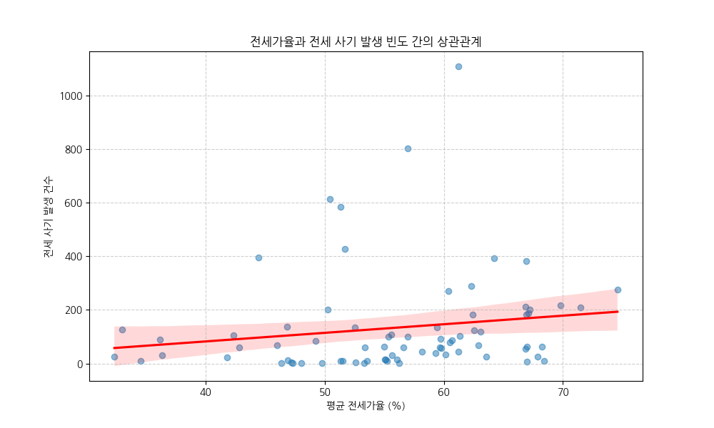
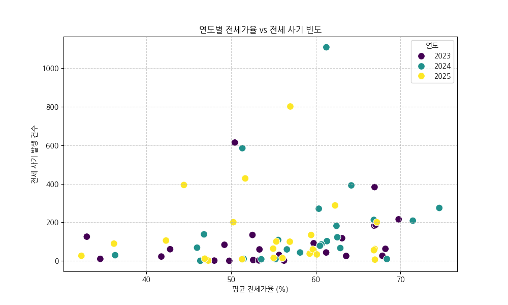

# 전세 사기 빈도와 전세가율 상관관계 분석 보고서

## 1. 분석 개요
- **목적**: 서울시 구별 전세가율 수준과 전세 사기 발생 빈도 사이의 상관관계를 파악하여, 전세가율이 높은 지역이 전세 사기에 취약한지 분석합니다.
- **분석 대상**: 2023년 ~ 2025년 서울시 구별 데이터

## 2. 분석 결과
- **피어슨 상관계수**: 0.1591
- **P-value**: 1.7273e-01

### 해석
통계적으로 유의미한 상관관계가 관찰되지 않았습니다 (P-value > 0.05).

## 3. 시각화
### 전세가율과 전세 사기 빈도 산점도 (전체)

### 연도별 추이

## 4. 데이터 요약 (상위 5건)
| gu_std   |   year |   사기발생빈도 |   jeonse_ratio_pct |
|:---------|-------:|---------:|-------------------:|
| 관악구      |   2024 |     1108 |            61.2505 |
| 관악구      |   2025 |      801 |            56.9949 |
| 강서구      |   2023 |      614 |            50.4485 |
| 강서구      |   2024 |      585 |            51.3354 |
| 강서구      |   2025 |      428 |            51.6726 |
| 동작구      |   2025 |      394 |            44.4331 |
| 동작구      |   2024 |      392 |            64.1958 |
| 관악구      |   2023 |      383 |            66.9443 |
| 금천구      |   2025 |      288 |            62.2821 |
| 동대문구     |   2024 |      275 |            74.5868 |
